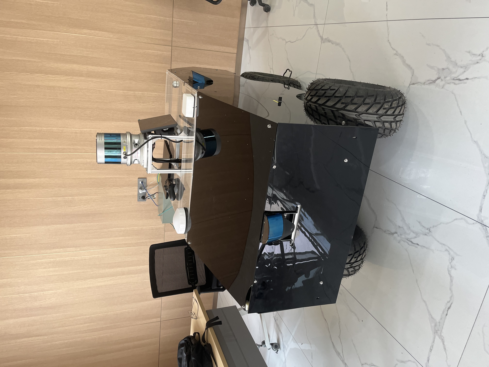

This project focuses on providing a remote monitoring, remote takeover, and control system for an L4-level small autonomous sweeper vehicle during its pre-production phase. In the event of autonomous driving failure, the remote driving system allows operators to remotely control the vehicle. The system provides real-time environmental awareness through video and audio streams, enabling effective remote operation and management.

## Key Responsibilities:

1. **Control Link and Security**: Designed and implemented the control link for the remote driving system, including peer-to-peer verification and secure encryption for RTSP and WebRTC streaming links.
2. **Streaming Speed Measurement Tool**: Developed a streaming speed measurement tool using OpenCV detection and EasyOCR with image preprocessing, resulting in a 100% performance improvement.
3. **Speech Synthesis and Audio Processing**: Created a speech synthesis and audio processing module integrating Azure Speech Services and a Flask-based speech synthesis service using PaddlePaddle models. Implemented Automatic Noise Suppression (ANS), Mixer, and Automatic Gain Control (AGC) functions to filter environmental noise, mix enhanced TTS prompt sounds, and play them in the cockpit.

<!--more-->
