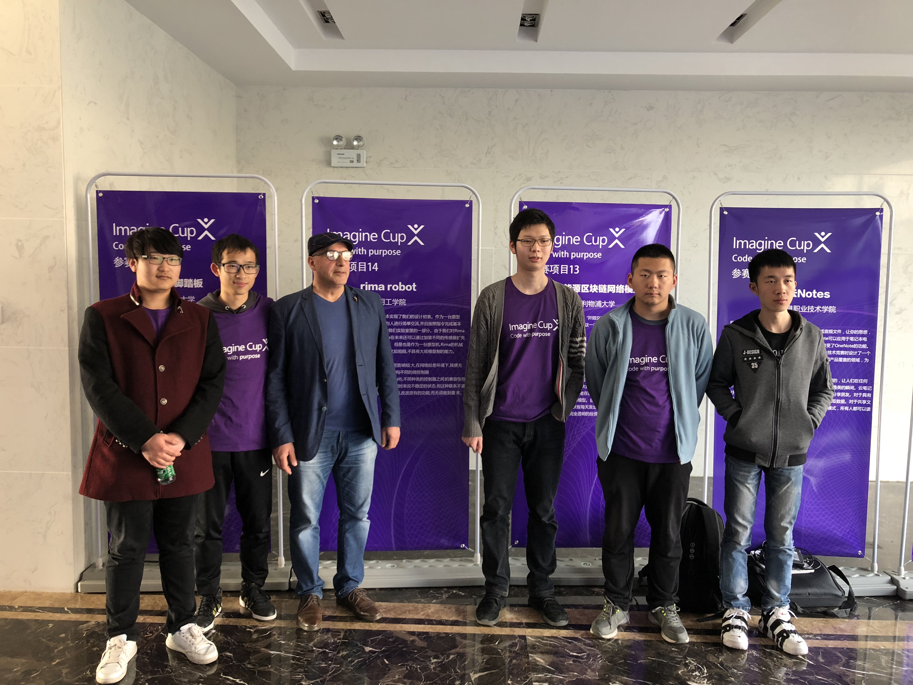



The RIMA2 robot builds upon its predecessor by restructuring the system architecture and codebase, significantly enhancing the robustness of voice interactions. It features a self-developed chatbot for more dynamic conversations and introduces a virtual avatar interface for a more immersive interaction experience. New mechanical improvements include 360-degree neck rotation and eye movement mechanisms, adding to its expressiveness and versatility in human-robot interactions.

<!--more-->
