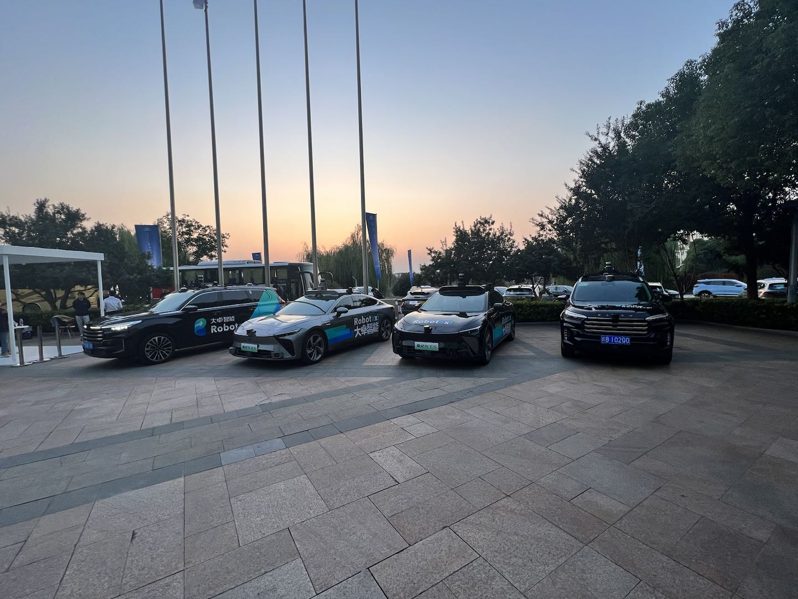
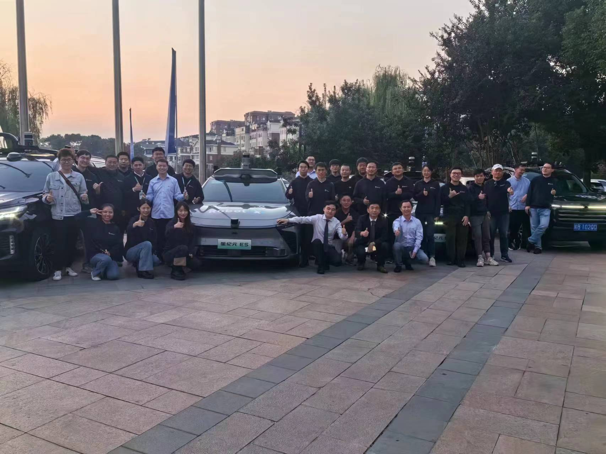

This project focuses on the development and deployment of an L4-level Robotaxi, achieving point-to-point passenger operations. The Robotaxi was showcased at Chery Technology Day, where it successfully transported domestic and international guests. The event was covered by CCTV, featuring a live broadcast demonstrating the vehicle's autonomous driving capabilities.

## Key Responsibilities:
1. **CMake and Bazel Cross-Compilation**: Responsible for cross-compiling Cyber RT to J5 and Orin chips using CMake and Bazel, troubleshooting various issues, and writing usage guides for multiple development boards.
   
2. **Cyber RT Middleware Development**: Developed the Cyber RT message middleware, implementing a ZMQ bridge for cross-domain message forwarding using shared memory. The solution supports cross-domain message visualization, recording, and the transmission of distributed trigger messages. This system has been deployed in Robotaxi, successfully running for hundreds of kilometers.

3. **Middleware Problem Solving**: Addressed critical issues encountered during L4 vehicle testing, such as timestamp disorder in backfilling, high CPU latency in the LiDAR perception link, TF data loss, control module failures under high CPU load, and loss of cross-domain messages during data logging.

<!--more-->
